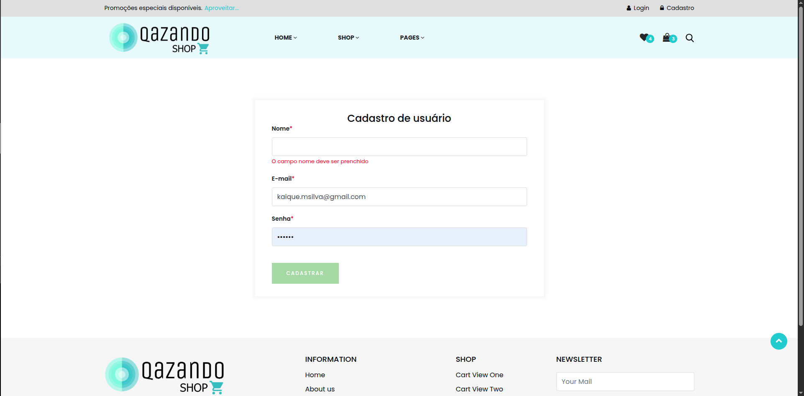

# Caso de Teste – CT003  
## Campos obrigatórios vazios

**ID:** CT003  
**Funcionalidade:** Cadastro de Usuário  
**Cenário Relacionado:** CEN03 – Campos obrigatórios vazios    
**Tipo:** Negativo  
**Prioridade:** Alta  
**Pré-condição:** Nenhuma  

---

### Objetivo
Validar que o sistema exiba mensagens de erro quando um ou mais campos obrigatórios não são preenchidos.

---

### Passos

1. Acessar a página de cadastro.
2. Deixar um ou mais campos obrigatórios em branco.
3. Clicar no botão **"Cadastrar"**.

---

### Resultado Esperado
- O sistema deve impedir o cadastro.  
- O sistema deve destacar os campos vazios.  
- Devem ser exibidas mensagens indicando os campos obrigatórios que precisam ser preenchidos.  

---

### Status
Passou ✅  

---

### Resultado Encontrado
O mesmo que o resultado esperado
  
---

### Evidências

