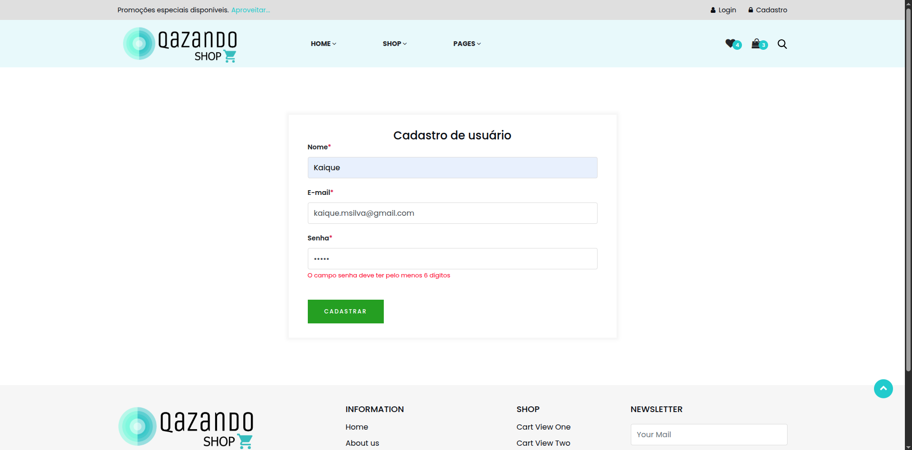

# Caso de Teste – CT004  
## Senha menor que 6 caracteres

**ID:** CT004  
**Funcionalidade:** Cadastro de Usuário  
**Cenário Relacionado:** CEN04 – Senha menor que 6 caracteres    
**Tipo:** Negativo  
**Prioridade:** Média  
**Pré-condição:** Nenhuma  

---

### Objetivo
Validar que o sistema bloqueia o cadastro quando a senha informada não atende aos requisitos mínimos.

---

### Passos

1. Acessar a página de cadastro.  
2. Preencher o campo "Nome".  
3. Preencher o campo "E-mail" com um e-mail válido e não cadastrado.  
4. Preencher o campo "Senha" com uma senha fraca (Menor que 6 caracteres).  
5. Clicar no botão **"Cadastrar"**.

---

### Resultado Esperado
- O sistema não deve permitir o cadastro.  
- O sistema deve exibir a mensagem: **"A senha deve conter no mínimo 6 caracteres"**.  
- O usuário permanece na mesma tela.   

---

### Status
Passou ✅  

---

### Resultado Encontrado
O mesmo que o resultado esperado
  
---

### Evidências

