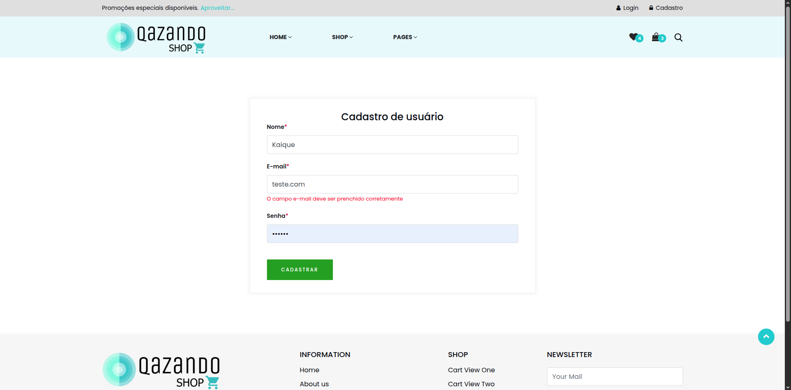

# Caso de Teste – CT005  
## E-mail em formato inválido

**ID:** CT005  
**Funcionalidade:** Cadastro de Usuário  
**Cenário Relacionado:** CEN05 – E-mail em formato inválido    
**Tipo:** Negativo  
**Prioridade:** Média  
**Pré-condição:** Nenhuma  

---

### Objetivo
Validar que o sistema não aceita e-mails fora do padrão correto.

---

### Passos

1. Acessar a página de cadastro.  
2. Preencher o campo "Nome".  
3. Preencher o campo "E-mail" com um formato inválido (ex.: "teste@", "emailteste", "teste.com").  
4. Preencher o campo "Senha" com uma senha válida.  
5. Clicar no botão **"Cadastrar"**.

---

### Resultado Esperado
- O sistema deve impedir o cadastro.  
- Deve exibir a mensagem: **"E-mail inválido"**.  
- O usuário deve permanecer na página de cadastro.    

---

### Status
Passou ✅  

---

### Resultado Encontrado
O mesmo que o resultado esperado
  
---

### Evidências

