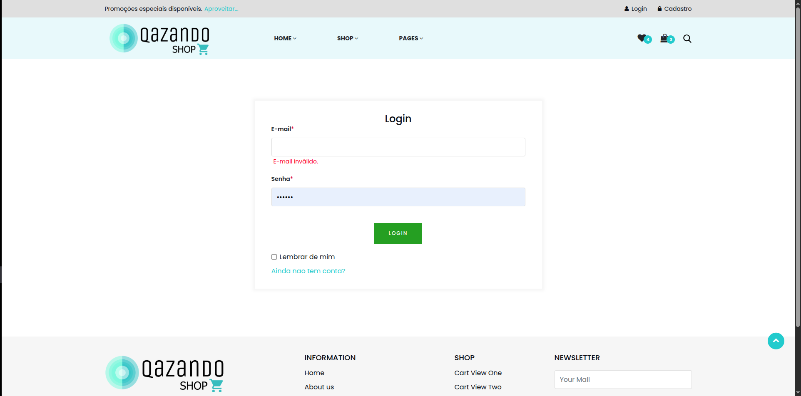

# Caso de Teste – CT010  
## Tentar logar com campo Email vazio

**ID:** CT010  
**Funcionalidade:** Login de Usuário  
**Cenário Relacionado:** CEN10 – Tentar logar com campo Email vazio    
**Tipo:** Negativo  
**Prioridade:** Alta  
**Pré-condição:** Nenhuma  

---

### Objetivo
Validar que o sistema exiba mensagem de erro quando o usuário tenta acessar sem preencher o campo de email.

---

### Passos
1. Acessar a página de login.  
2. Deixar o campo "E-mail" vazio.  
3. Preencher o campo "Senha" com qualquer valor válido.  
4. Clicar no botão **"Login"**. 

---

### Resultado Esperado
- O sistema deve impedir o login.  
- Deve exibir mensagens indicando o campo obrigatório: 
  - **"Email inválido."**  
- O usuário permanece na página de login. 

---

### Status
Passou ✅ 

---

### Resultado Encontrado
O mesmo que o esperado
  
---

### Evidências

