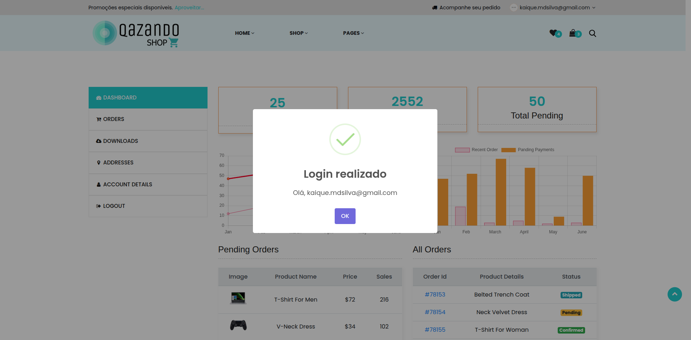

# Caso de Teste – CT006  
## Login com credenciais corretas

**ID:** CT006  
**Funcionalidade:** Login de Usuário  
**Cenário Relacionado:** CEN06 – Login com credenciais corretas    
**Tipo:** Positivo  
**Prioridade:** Alta  
**Pré-condição:** Usuário deve estar cadastrado na plataforma  

---

### Objetivo
Validar que o sistema permite que um usuário cadastrado acesse sua conta.

---

### Passos

1. Acessar a página de login.  
2. Preencher o campo "E-mail" com um e-mail válido cadastrado.
3. Preencher o campo "Senha" com uma senha válida.  
4. Clicar no botão **"Login"**.  

---

### Resultado Esperado
- O sistema deve autenticar o usuário com sucesso.  
- O usuário deve ser redirecionado para a página inicial.  
- Deve ser exibida uma mensagem de **"Login realizado"**.  
- O usuário deve permanecer autenticado no sistema. 

---

### Status
Passou ✅  

---

### Resultado Encontrado
O mesmo que o resultado esperado
  
---

### Evidências

