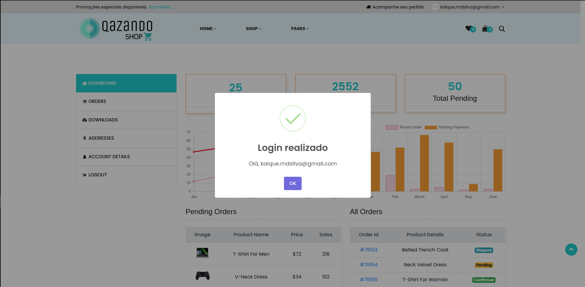

# Caso de Teste – CT007  
## Login com senha incorreta

**ID:** CT007  
**Funcionalidade:** Login de Usuário  
**Cenário Relacionado:** CEN07 – Login com senha incorreta    
**Tipo:** Negativo  
**Prioridade:** Alta  
**Pré-condição:** Usuário deve estar cadastrado na plataforma  

---

### Objetivo
Validar que o sistema bloqueia o acesso quando o usuário informa a senha incorreta.

---

### Passos

1. Acessar a página de login.  
2. Preencher o campo "E-mail" com um e-mail válido cadastrado.
3. Preencher o campo "Senha" com uma senha inválida.  
4. Clicar no botão **"Login"**.  

---

### Resultado Esperado
- O sistema deve rejeitar o login.  
- Deve exibir mensagem: **"E-mail ou senha inválidos"**.  
- O usuário deve permanecer na tela de login. 

---

### Status
Falhou ❌  

---

### Resultado Encontrado
Sistema permite o acesso mesmo digitando uma senha não cadastrada.
  
---

### Evidências

