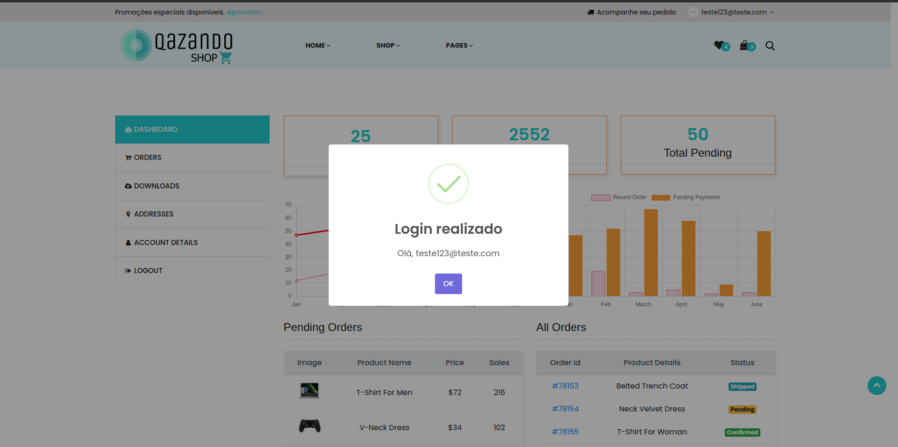

# Caso de Teste – CT008  
## Login com e-mail não cadastrado

**ID:** CT008  
**Funcionalidade:** Login de Usuário  
**Cenário Relacionado:** CEN08 – Login com e-mail não cadastrado    
**Tipo:** Negativo  
**Prioridade:** Alta  
**Pré-condição:** Usuário não deve estar cadastrado na plataforma  

---

### Objetivo
Validar que o sistema impeça o login quando é informado um email não cadastrado.

---

### Passos

1. Acessar a página de login.  
2. Preencher o campo "E-mail" com um endereço de email não cadastrado.
3. Preencher o campo "Senha" com qualquer valor válido.  
4. Clicar no botão **"Login"**.  

---

### Resultado Esperado
- O sistema deve rejeitar o login.  
- Deve exibir mensagem: **"E-mail ou senha inválidos"**.  
- O usuário deve permanecer na tela de login. 

---

### Status
Falhou ❌  

---

### Resultado Encontrado
Sistema permite o acesso mesmo digitando um email não cadastrado.
  
---

### Evidências

