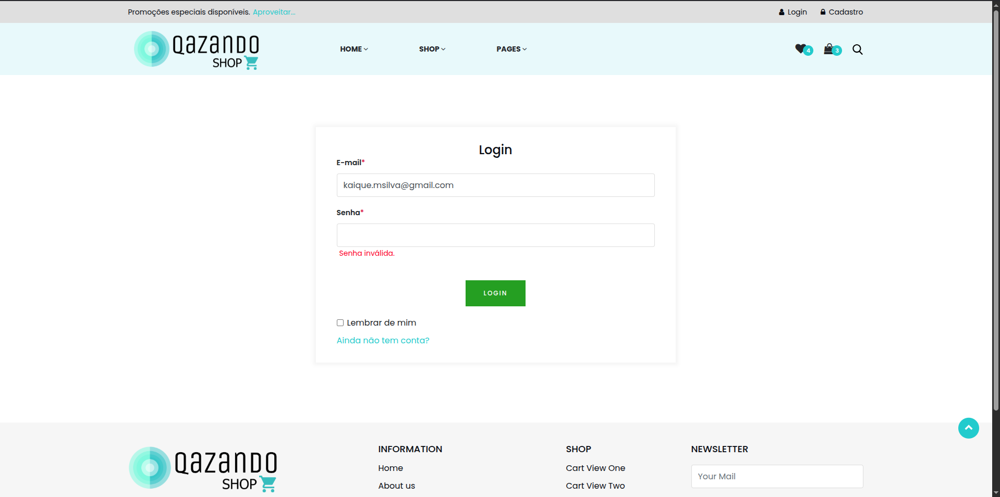

# Caso de Teste – CT009  
## Tentar logar com campo Senha vazio

**ID:** CT009  
**Funcionalidade:** Login de Usuário  
**Cenário Relacionado:** CEN09 – Tentar logar com campo Senha vazio    
**Tipo:** Negativo  
**Prioridade:** Alta  
**Pré-condição:** Usuário com email cadastrado na plataforma  

---

### Objetivo
Validar que o sistema exiba mensagem de erro quando o usuário tenta acessar sem preencher o campo de senha.

---

### Passos
1. Acessar a página de login.  
2. Preencher o campo "E-mail" com um e-mail cadastrado.  
3. Deixar o campo "Senha" vazio.  
4. Clicar no botão **"Login"**. 

---

### Resultado Esperado
- O sistema deve impedir o login.  
- Deve exibir mensagens indicando o campo obrigatório: 
  - **"Senha inválida."**  
- O usuário permanece na página de login. 

---

### Status
Passou ✅ 

---

### Resultado Encontrado
O mesmo que o esperado
  
---

### Evidências

