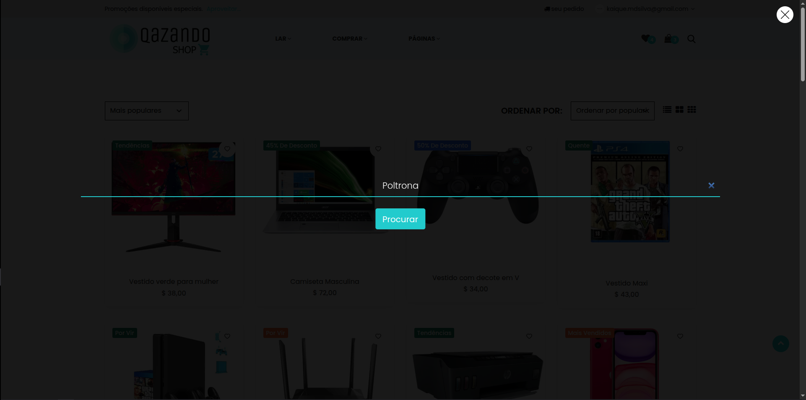

# Caso de Teste – CT011  
## Busca por produto existente

**ID:** CT011  
**Funcionalidade:** Busca de produtos  
**Cenário Relacionado:** CEN11 – Busca por produto existente    
**Tipo:** Positivo  
**Prioridade:** Alta  
**Pré-condição:** Usuário e o produto buscado devem estar cadastrados no sistema  

---

### Objetivo
Validar que o sistema retorna corretamente os produtos correspondentes quando o usuário realiza uma busca utilizando um termo válido.

---

### Passos
1. Acessar a página inicial da loja.   
2. Localizar o campo de busca.   
3. Digitar um termo válido correspondente a um produto existente.    
4. Clicar no botão **"Procurar"** ou pressionar **Enter**.   

---

### Resultado Esperado
- O sistema deve exibir uma lista de produtos relacionados ao termo pesquisado.  
- O nome, imagem e preço dos produtos devem ser exibidos corretamente.  
- A página deve permitir navegação para a página de detalhes do produto.  

---

### Status
Falhou ❌ 

---

### Resultado Encontrado
- O resultado da busca está retornando diversos produtos fora do termo buscado
- Os produtos retornados estão com imagem, descrição e preço divergentes
  
---

### Evidências
**TERMO BUSCADO**

**RESULTADO OBTIDO**
.png)

