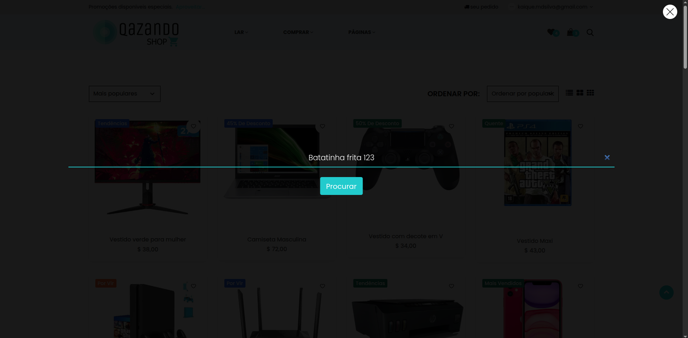

# Caso de Teste – CT012  
## Busca por produto inexistente

**ID:** CT012  
**Funcionalidade:** Busca de produtos  
**Cenário Relacionado:** CEN12 – Busca por produto inexistente    
**Tipo:** Negativo  
**Prioridade:** Média  
**Pré-condição:** Usuário deve estar cadastrado no sistema e o produto não deve ser cadastrado no catálogo

---

### Objetivo
Validar que o sistema exiba uma mensagem adequada quando o usuário busca por um termo que não corresponde a nenhum produto.

---

### Passos
1. Acessar a página inicial da loja.   
2. Localizar o campo de busca.   
3. Digitar um termo inexistente.    
4. Clicar no botão **"Procurar"** ou pressionar **Enter**.   

---

### Resultado Esperado
- O sistema deve exibir a mensagem: **"Nenhum produto encontrado"**.
- Nenhuma lista de produtos deve ser exibida.  
- O campo de busca deve permanecer acessível para nova consulta.  

---

### Status
Falhou ❌ 

---

### Resultado Encontrado
- O resultado da busca está retornando diversos produtos fora do termo buscado
- Os produtos retornados estão com imagem, descrição e preço divergentes
  
---

### Evidências
**TERMO BUSCADO**

**RESULTADO OBTIDO**
.png)

