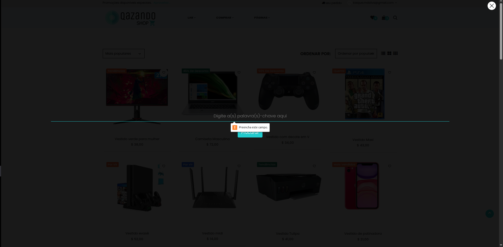

# Caso de Teste – CT013  
## Busca por produto com campo vazio

**ID:** CT013  
**Funcionalidade:** Busca de produtos  
**Cenário Relacionado:** CEN13 – Busca por produto com campo vazio    
**Tipo:** Negativo  
**Prioridade:** Baixa  
**Pré-condição:** Usuário deve estar cadastrado no sistema

---

### Objetivo
Validar que o sistema trata corretamente a tentativa de realizar uma busca sem inserir nenhum termo.

---

### Passos
1. Acessar a página inicial da loja.   
2. Deixar o campo de busca vazio.   
4. Clicar no botão **"Procurar"** ou pressionar **Enter**.   

---

### Resultado Esperado
- O sistema deve exibir uma mensagem informando que é necessário inserir um termo antes de buscar.  
- A busca não deve ser executada.  
- Nenhuma lista de produtos deve ser exibida.   

---

### Status
Passou ✅ 

---

### Resultado Encontrado
O mesmo que o esperado
  
---

### Evidências

