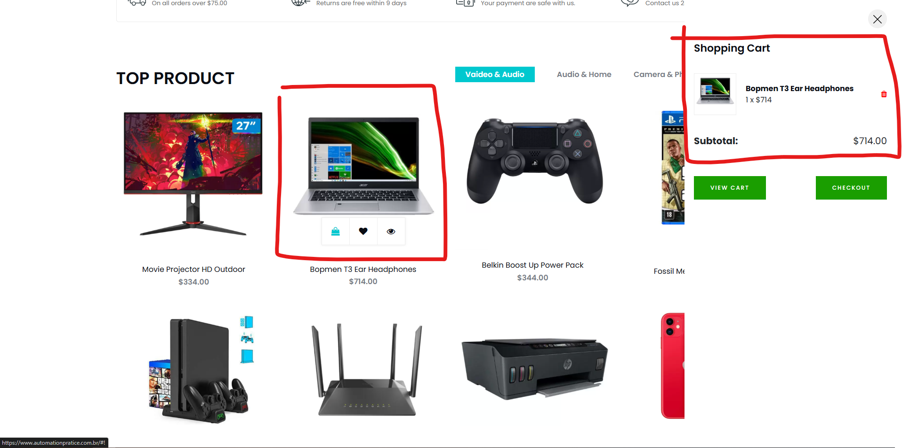

# Caso de Teste – CT014  
## Adicionar produto ao carrinho

**ID:** CT014  
**Funcionalidade:** Carrinho  
**Cenário Relacionado:** CEN14 – Adicionar produto ao carrinho     
**Tipo:** Positivo  
**Prioridade:** Alta  
**Pré-condição:** Usuário deve estar cadastrado no sistema e produto disponível no catálogo

---

### Objetivo
Validar que o sistema permite adicionar um produto ao carrinho quando disponível.

---

### Passos
1. Acessar a página do produto.  
2. Verificar se o produto está disponível para compra.  
3. Clicar no botão **"Adicionar ao Carrinho"**.  
4. Acessar o ícone ou página do carrinho.

---

### Resultado Esperado
- O produto deve ser adicionado ao carrinho.  
- A quantidade do item deve ser exibida corretamente.  
- O carrinho deve atualizar o valor total.   

---

### Status
Passou ✅ 

---

### Resultado Encontrado
O mesmo que o esperado
  
---

### Evidências

