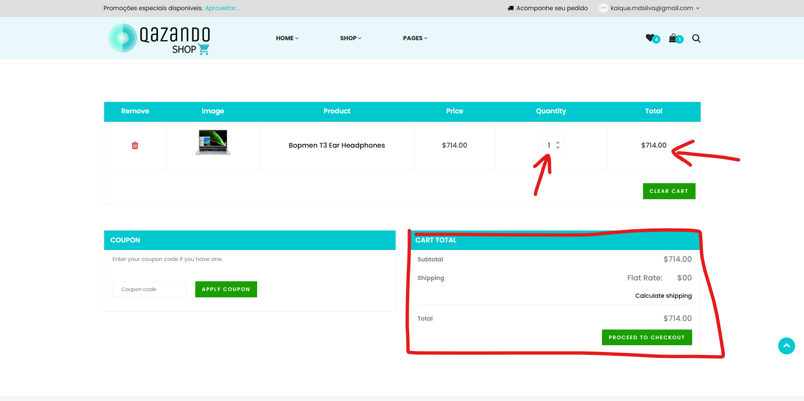

# Caso de Teste – CT016  
## Atualizar quantidade de itens

**ID:** CT016  
**Funcionalidade:** Carrinho  
**Cenário Relacionado:** CEN16 – Atualizar quantidade de itens     
**Tipo:** Positivo  
**Prioridade:** Média  
**Pré-condição:** Usuário deve estar cadastrado no sistema e deve ter pelo menos um item no carrinho

---

### Objetivo
Validar que o usuário pode alterar a quantidade de um item no carrinho.

---

### Passos
1. Acessar o carrinho de compras.  
2. Localizar o item desejado.  
3. Alterar a quantidade usando o campo ou botões ( 🔼 / 🔽).  

---

### Resultado Esperado
- A quantidade deve ser atualizada corretamente.  
- O valor total deve ser recalculado.  
- Não deve permitir valores negativos ou inválidos.  

---

### Status
Passou ✅ 

---

### Resultado Encontrado
O mesmo que o esperado
  
---

### Evidências
**CARRINHO ANTES DE ADICIONAR MAIS UM PRODUTO**

**CARRINHO DEPOIS ADICIONAR MAIS UM PRODUTO**
.png)

