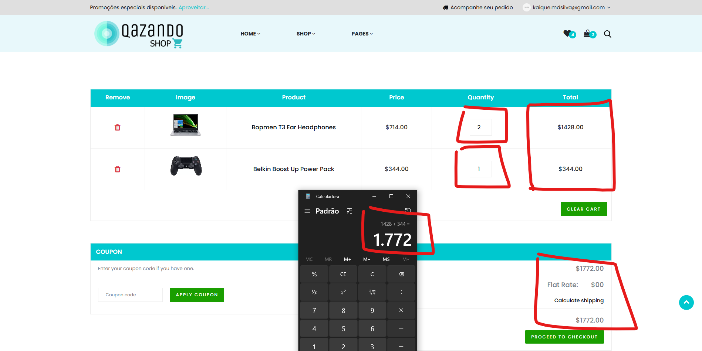

# Caso de Teste – CT017  
## Validar cálculo total do carrinho

**ID:** CT017  
**Funcionalidade:** Carrinho  
**Cenário Relacionado:** CEN17 – Validar cálculo total do carrinho     
**Tipo:** Positivo  
**Prioridade:** Alta  
**Pré-condição:** Usuário deve estar cadastrado no sistema e carrinho com itens adicionados

---

### Objetivo
Garantir que o cálculo total (quantidade × preço unitário) está correto.

---

### Passos
1. Acessar o carrinho.  
2. Verificar preço unitário e quantidade de cada item.  
3. Confirmar se o total calculado corresponde à soma dos itens.    

---

### Resultado Esperado
- Total exibido deve ser exatamente o valor calculado.  
- O sistema deve atualizar automaticamente caso quantidades mudem. 

---

### Status
Passou ✅ 

---

### Resultado Encontrado
O mesmo que o esperado
  
---

### Evidências

