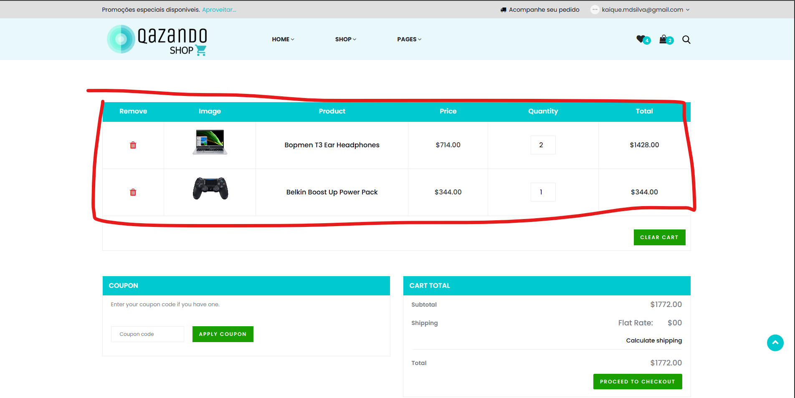

# Caso de Teste – CT018  
## Carrinho vazio após remover todos os itens

**ID:** CT018  
**Funcionalidade:** Carrinho  
**Cenário Relacionado:** CEN18 – Carrinho vazio após remover todos os itens     
**Tipo:** Positivo  
**Prioridade:** Média  
**Pré-condição:** Usuário deve estar cadastrado no sistema e carrinho previamente preenchido

---

### Objetivo
Validar que o sistema exibe o carrinho vazio após remoção de todos os itens.

---

### Passos
1. Acessar o carrinho.  
2. Remover todos os produtos.     

---

### Resultado Esperado
- O carrinho deve exibir a mensagem: **"Seu carrinho está vazio"** ou equivalente.  
- Não deve haver itens listados.  
- Não deve exibir valores de total. 

---

### Status
Passou ✅ 

---

### Resultado Encontrado
O mesmo que o esperado
  
---

### Evidências
**CARRINHO ANTES DE REMOVER TODOS OS PRODUTOS**

**CARRINHO DEPOIS DE REMOVER TODOS OS PRODUTOS**
.png)

