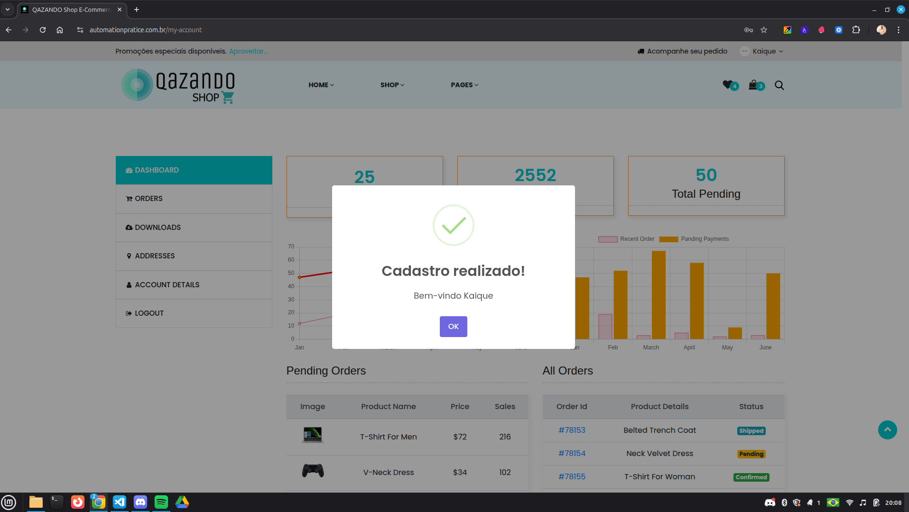

# Caso de Teste – CT001  
## Cadastro com dados válidos

**ID:** CT001  
**Funcionalidade:** Cadastro de Usuário  
**Cenário Relacionado:** CEN01 – Cadastro com dados válidos  
**Tipo:** Positivo  
**Prioridade:** Alta  
**Pré-condição:** Usuário ainda não cadastrado no sistema  

---

### Objetivo
Validar que o sistema permite a criação de um novo usuário quando todos os dados obrigatórios são preenchidos corretamente.

---

### Passos

1. Acessar a página de cadastro.
2. Preencher o campo "Nome".
3. Preencher o campo "E-mail" com um endereço válido e ainda não cadastrado.
4. Preencher o campo "Senha" com uma senha válida (mínimo de 6 caracteres).
5. Clicar no botão **"Cadastrar"**.

---

### Resultado Esperado
- O sistema deve criar a conta com sucesso.  
- Usuário deve ser redirecionado para o painel do usuário.  
- Deve ser exibida uma mensagem de confirmação, como: **"Cadastro realizado! Bem-vindo (Nome)**.  

---

### Evidências

